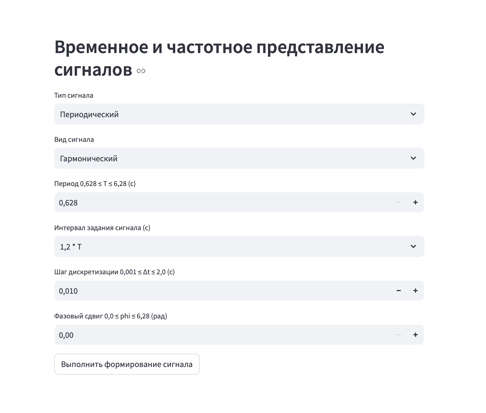
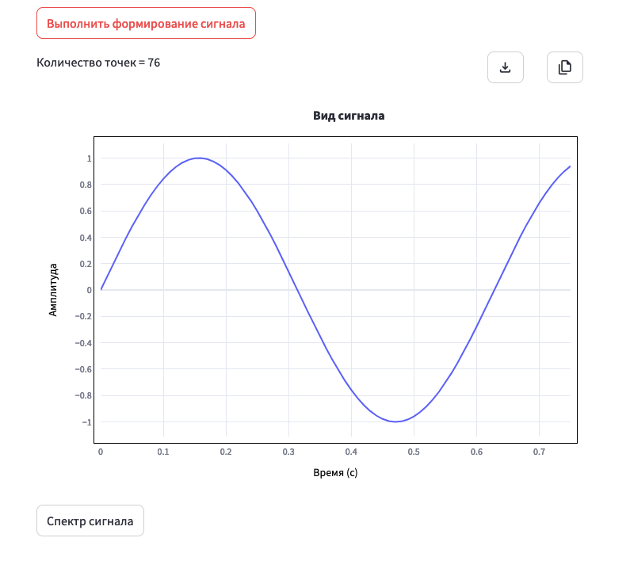
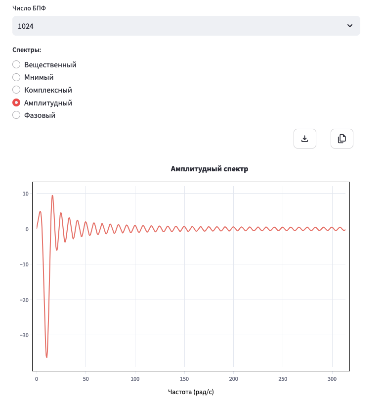

# Документация к проекту "Временное и частотное представление сигналов"

## Оглавление
- [Введение](#введение)
- [Функциональные требования](#функциональные-требования)
  - [Представление данных](#представление-данных)
  - [Формирование сигналов](#формирование-сигналов)
  - [Построение графиков](#построение-графиков)
  - [Опции](#опции)
- [Описание сигналов](#описание-сигналов)
  - [Периодические сигналы](#периодические-сигналы)
  - [Апериодические сигналы](#апериодические-сигналы)
  - [Специальные сигналы](#специальные-сигналы)
- [Спектры](#спектры)
- [Дополнительные функции](#дополнительные-функции)
- [Примеры использования](#примеры-использования)
- [Установка и интеграция](#установка-и-интеграция)

---

## Демо

### Основная страница:


### График:


### Спектр:


## Введение

Проект представляет собой приложение для генерации сигналов, их анализа во временной и частотной областях, а также построения графиков для визуализации. Оно предназначено для работы с различными видами сигналов и спектров, позволяя пользователю настроить параметры генерации и изучить результаты.

---

## Функциональные требования

### Представление данных

1. **Входные данные**:
   - Пользователь вводит параметры для генерации сигнала, такие как период, амплитуда, частота и шаг дискретизации.
2. **Выходные данные**:
   - Построенные графики сигналов и их спектров.

### Формирование сигналов

**Виды сигналов**:
- **Периодические**:
  - Гармонический сигнал.
  - Полигармонический сигнал.
  - Однополярные импульсы.
  - Разнополярные импульсы.
- **Апериодические**:
  - Затухающая синусоида.
- **Специальные**:
  - Одиночный импульс.
  - Единичный скачок.
  - Дельта-функция.

**Параметры сигналов**:
- Для каждого вида сигнала предусмотрены параметры, такие как интервал задания, шаг дискретизации, количество гармоник или импульсов.

### Построение графиков

**Виды графиков**:
- График временной области.
- График спектров:
  - Амплитудный.
  - Комплексный.
  - Вещественный.
  - Мнимый.
  - Фазовый.

**Настройки графиков**:
- Пользователь может задавать длину сигнала, количество точек и параметры спектрального анализа (число точек для БПФ).

### Опции

- **Сохранение графиков** в различных форматах.
- **Копирование графиков** для использования в других приложениях.
- **Масштабирование** для удобного анализа.

---

## Описание сигналов

### Периодические сигналы

#### **1. Гармонический сигнал**
- **Формула**:
  \[
  s(t) = A \cdot \sin\left(\frac{2 \pi t}{T}\right)
  \]
- **Параметры**:
  - Амплитуда \(A\).
  - Период \(T\) (\(0.628 \leq T \leq 6.28\)).
  - Интервал задания.
  - Шаг дискретизации (\(\Delta t\)).

#### **2. Полигармонический сигнал**
- **Формула**:
  \[
  s(t) = \sum_{i=1}^{k} A_i \cdot \sin\left(\frac{2 \pi i t}{T}\right)
  \]
- **Параметры**:
  - Количество гармоник (\(2 \leq k \leq 5\)).
  - Период базовой гармоники.
  - Шаг дискретизации.

#### **3. Однополярные импульсы**
- **Формула**:
  \[
  s(t) = 
  \begin{cases} 
  1, & t \in \text{диапазон импульса} \\
  0, & \text{иначе}
  \end{cases}
  \]
- **Параметры**:
  - Количество импульсов (\(2 \leq k \leq 7\)).
  - Длительность импульса (\(0.628 \leq T \leq 6.28\)).
  - Интервал задания.

#### **4. Разнополярные импульсы**
- **Формула**:
  \[
  s(t) = 
  \begin{cases} 
  1, & t \in \text{нечетный импульс} \\
  -1, & t \in \text{четный импульс} \\
  0, & \text{иначе}
  \end{cases}
  \]
- **Параметры**: аналогичны однополярным импульсам.

### Апериодические сигналы

#### **1. Затухающая синусоида**
- **Формула**:
  \[
  s(t) = A \cdot e^{-\alpha t} \cdot \sin(2 \pi \beta t)
  \]
- **Параметры**:
  - Амплитуда \(A\).
  - Коэффициент затухания \(\alpha\) (\(0.1 \leq \alpha \leq 0.5\)).
  - Частота \(\beta\) (\(1 \leq \beta \leq 10\)).

### Специальные сигналы

#### **1. Одиночный импульс**
- **Формула**:
  \[
  s(t) = 
  \begin{cases} 
  1, & 0 \leq t < T \\
  0, & \text{иначе}
  \end{cases}
  \]

#### **2. Единичный скачок**
- **Формула**:
  \[
  s(t) = 
  \begin{cases} 
  1, & t \geq T \\
  0, & t < T
  \end{cases}
  \]

#### **3. Дельта-функция**
- **Формула**:
  \[
  s(t) = 
  \begin{cases} 
  A, & t = T \\
  0, & \text{иначе}
  \end{cases}
  \]

---

## Спектры

### **1. Вещественный спектр**
- Мнимая часть обнуляется.

### **2. Мнимый спектр**
- Учитывается только мнимая часть спектра.

### **3. Комплексный спектр**
- Полный спектральный анализ.

### **4. Амплитудный спектр**
- Модуль спектральных значений.

### **5. Фазовый спектр**
- Фазы спектра на разных частотах.

---

## Дополнительные функции

1. **Копирование графика**:
   - Возможность сохранить в буфер обмена для последующего использования.
2. **Сохранение графика**:
   - Экспорт в PNG или HTML.
3. **Масштабирование**:
   - Изменение диапазона отображения графика.

---

## Примеры использования

### **Гармонический сигнал**
```python
t, s = generate_harmonic(frequency=1, duration=10, step=0.01, shift=0)
plt.plot(t, s)
plt.title("Гармонический сигнал")
plt.show()
```

### **Спектральный анализ**
```python
fft_val = np.fft.fft(signal, n=1024)
fft_freq = np.fft.fftfreq(1024, d=0.01)
plt.plot(fft_freq, np.abs(fft_val))
plt.title("Амплитудный спектр")
plt.show()
```

---

## Установка и интеграция

1. Установить зависимости:
   ```bash
   pip install streamlit plotly numpy
   ```
2. Запустить приложение:
   ```bash
   streamlit run app.py
   ```
3. Импортировать и использовать функции:
   ```python# Документация к проекту "Временное и частотное представление сигналов"

## Оглавление
- [Введение](#введение)
- [Функциональные требования](#функциональные-требования)
  - [Представление данных](#представление-данных)
  - [Формирование сигналов](#формирование-сигналов)
  - [Построение графиков](#построение-графиков)
  - [Опции](#опции)
- [Описание сигналов](#описание-сигналов)
  - [Периодические сигналы](#периодические-сигналы)
  - [Апериодические сигналы](#апериодические-сигналы)
  - [Специальные сигналы](#специальные-сигналы)
- [Спектры](#спектры)
- [Дополнительные функции](#дополнительные-функции)
- [Примеры использования](#примеры-использования)
- [Установка и интеграция](#установка-и-интеграция)

---

## Демо

### Основная страница:


### График:


### Спектр:


## Введение

Проект представляет собой приложение для генерации сигналов, их анализа во временной и частотной областях, а также построения графиков для визуализации. Оно предназначено для работы с различными видами сигналов и спектров, позволяя пользователю настроить параметры генерации и изучить результаты.

---

## Функциональные требования

### Представление данных

1. **Входные данные**:
   - Пользователь вводит параметры для генерации сигнала, такие как период, амплитуда, частота и шаг дискретизации.
2. **Выходные данные**:
   - Построенные графики сигналов и их спектров.

### Формирование сигналов

**Виды сигналов**:
- **Периодические**:
  - Гармонический сигнал.
  - Полигармонический сигнал.
  - Однополярные импульсы.
  - Разнополярные импульсы.
- **Апериодические**:
  - Затухающая синусоида.
- **Специальные**:
  - Одиночный импульс.
  - Единичный скачок.
  - Дельта-функция.

**Параметры сигналов**:
- Для каждого вида сигнала предусмотрены параметры, такие как интервал задания, шаг дискретизации, количество гармоник или импульсов.

### Построение графиков

**Виды графиков**:
- График временной области.
- График спектров:
  - Амплитудный.
  - Комплексный.
  - Вещественный.
  - Мнимый.
  - Фазовый.

**Настройки графиков**:
- Пользователь может задавать длину сигнала, количество точек и параметры спектрального анализа (число точек для БПФ).

### Опции

- **Сохранение графиков** в различных форматах.
- **Копирование графиков** для использования в других приложениях.
- **Масштабирование** для удобного анализа.

---

## Описание сигналов

### Периодические сигналы

#### **1. Гармонический сигнал**
- **Формула**:
  \[
  s(t) = A \cdot \sin\left(\frac{2 \pi t}{T}\right)
  \]
- **Параметры**:
  - Амплитуда \(A\).
  - Период \(T\) (\(0.628 \leq T \leq 6.28\)).
  - Интервал задания.
  - Шаг дискретизации (\(\Delta t\)).

#### **2. Полигармонический сигнал**
- **Формула**:
  \[
  s(t) = \sum_{i=1}^{k} A_i \cdot \sin\left(\frac{2 \pi i t}{T}\right)
  \]
- **Параметры**:
  - Количество гармоник (\(2 \leq k \leq 5\)).
  - Период базовой гармоники.
  - Шаг дискретизации.

#### **3. Однополярные импульсы**
- **Формула**:
  \[
  s(t) = 
  \begin{cases} 
  1, & t \in \text{диапазон импульса} \\
  0, & \text{иначе}
  \end{cases}
  \]
- **Параметры**:
  - Количество импульсов (\(2 \leq k \leq 7\)).
  - Длительность импульса (\(0.628 \leq T \leq 6.28\)).
  - Интервал задания.

#### **4. Разнополярные импульсы**
- **Формула**:
  \[
  s(t) = 
  \begin{cases} 
  1, & t \in \text{нечетный импульс} \\
  -1, & t \in \text{четный импульс} \\
  0, & \text{иначе}
  \end{cases}
  \]
- **Параметры**: аналогичны однополярным импульсам.

### Апериодические сигналы

#### **1. Затухающая синусоида**
- **Формула**:
  \[
  s(t) = A \cdot e^{-\alpha t} \cdot \sin(2 \pi \beta t)
  \]
- **Параметры**:
  - Амплитуда \(A\).
  - Коэффициент затухания \(\alpha\) (\(0.1 \leq \alpha \leq 0.5\)).
  - Частота \(\beta\) (\(1 \leq \beta \leq 10\)).

### Специальные сигналы

#### **1. Одиночный импульс**
- **Формула**:
  \[
  s(t) = 
  \begin{cases} 
  1, & 0 \leq t < T \\
  0, & \text{иначе}
  \end{cases}
  \]

#### **2. Единичный скачок**
- **Формула**:
  \[
  s(t) = 
  \begin{cases} 
  1, & t \geq T \\
  0, & t < T
  \end{cases}
  \]

#### **3. Дельта-функция**
- **Формула**:
  \[
  s(t) = 
  \begin{cases} 
  A, & t = T \\
  0, & \text{иначе}
  \end{cases}
  \]

---

## Спектры

### **1. Вещественный спектр**
- Мнимая часть обнуляется.

### **2. Мнимый спектр**
- Учитывается только мнимая часть спектра.

### **3. Комплексный спектр**
- Полный спектральный анализ.

### **4. Амплитудный спектр**
- Модуль спектральных значений.

### **5. Фазовый спектр**
- Фазы спектра на разных частотах.

---

## Дополнительные функции

1. **Копирование графика**:
   - Возможность сохранить в буфер обмена для последующего использования.
2. **Сохранение графика**:
   - Экспорт в PNG или HTML.
3. **Масштабирование**:
   - Изменение диапазона отображения графика.

---

## Примеры использования

### **Гармонический сигнал**
```python
t, s = generate_harmonic(frequency=1, duration=10, step=0.01, shift=0)
plt.plot(t, s)
plt.title("Гармонический сигнал")
plt.show()
```

### **Спектральный анализ**
```python
fft_val = np.fft.fft(signal, n=1024)
fft_freq = np.fft.fftfreq(1024, d=0.01)
plt.plot(fft_freq, np.abs(fft_val))
plt.title("Амплитудный спектр")
plt.show()
```

---

## Опробовать приложение в деле

https://appapp-ggyfhhhycj4o84cbeqjngt.streamlit.app/

## Установка и интеграция локально

1. Установить зависимости:
   ```bash
   pip install -r requirements.txt
   ```
2. Запустить приложение:
   ```bash
   streamlit run app.py
   ```

--- 

Эта документация описывает основные аспекты использования проекта и может быть расширена для конкретных случаев применения.
   from signal_noise_generator.signal_generator.signals import generate_harmonic
   ``` 

--- 

Эта документация описывает основные аспекты использования проекта и может быть расширена для конкретных случаев применения.